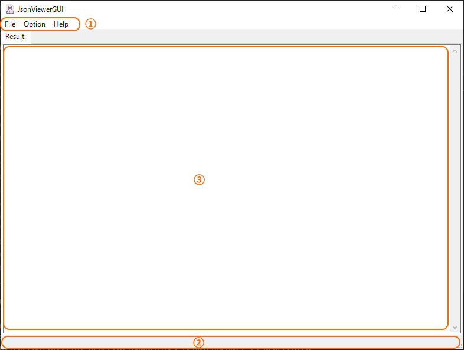
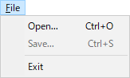
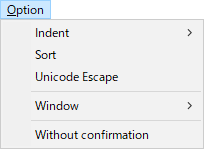
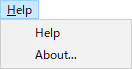

#  JSONファイル整形表示ツール  - JsonViewerGUI (JsonViewer) - #

## §各部の名称
※UIの表記が英語なのは、GUIデザインツール(wxGlade)がShift-JISに対応していないためです。※<br>
<br>
<br>
1. メニューバー<br>
    メインメニューです。<br>
    詳細は「メニューの説明」を参照してください。<br>
    <br>
2. ステータスバー<br>
    操作結果のメッセージが表示されます。<br>
    <br>
3. 整形プレビュー<br>
    整形後のJSON文字列が表示されます。<br>
    <br>

## §使い方
1. JSONファイルの整形と保存
    * [File]-[Open...]メニューでファイル選択ダイアログを開き、整形するJSONファイルを選択するか、<br>
      整形プレビュー（③）に、JSONファイルをDropすると、整形して表示します。<br>
    * [File]-[Save...]メニューでファイル保存ダイアログを開き、保存ファイル名を指定します。<br>
      予め「元のファイル名_formatted.json」がデフォルトのファイル名として用意されます。<br>
      既存のファイル名を指定した場合は、上書きするかどうかの確認がされます。<br>
    <br>

2. 整形パラメータの設定<br>
    * [Option]-[Indent]のサブメニューで、インデントの文字数が選択できます。<br>
      デフォルトは「４文字」です。<br>
    * [Option]-[Sort]をチェックすると、「Key」を昇順ソートして整形します。<br>
      デフォルトは「ソートなし」です。<br>
    * [Option]-[Unicode Escape]をチェックすると、Unicode文字列はエスケープ表記に変換します。<br>
      デフォルトは「エスケープなし」です。<br>
    * [Option]-[Window]-[Stay on Top]をチェックすると、ツールのウィンドウをデスクトップ最前面に固定します。<br>
      デフォルトは「固定なし」です。<br>
    * [Option]-[Window]-[Remember Current Window pos.]をチェックすると、ツール終了時のウィンドウ位置を記憶して次回起動時に再現します。<br>
      デフォルトは「記憶なし」です。<br>
    * [Option]-[Without comfirmation]をチェックすると、ツール終了時に確認ダイアログを出さずに終了します。<br>
      デフォルトは「確認ダイアログあり」です。<br>
    * 以上の設定は、ツール終了時に設定ファイル（JsonViewer.ini）に保存されます。<br>
    <br>

## §メニューの説明
| メニュー | 説明 |
| ------- | --- |
|    | [Open...] - 整形するJSONファイルの選択<br>[Save...] - 整形済みJSON文字列の保存<br>---<br>[Exit] - アプリケーションの終了 |
|  | [Indent] - インデント文字数の指定 (0, 2, 4, 8)<br>[Sort] - JSONのKeyを昇順ソート<br>[Unicode Escape] - Unicode文字列をエスケープ表記<br>---<br>[Window]-[Stay on Top] - ウィンドウを最前面に固定<br>[Window]-[Remember Current Window pos.] - 前回終了時のウィンドウ位置の復元<br>---<br>[Without confirmation] - ツール終了時の確認ダイアログなし |
|    | [Help] - Manual.htmlを開く<br>[About] - バージョン情報の表示 |
<br>

## §コンソール版 (jsonviewer)
### 1. 使い方
1. コマンドプロンプトから実行する場合  
    ```
    > jsonviewer [オプション] JSONファイル名
    ```
2. 「送る」メニューから実行する場合  
    - 「送る」メニュー(`%APPDATA%Microsoft\Windows\SendTo\`)にショートカットを追加します。(オプションはショートカット(プロパティ)に設定します)<br>
    - エクスプローラでファイルやフォルダを選択し、右クリックからコピーしたショートカットを実行します。<br>
    <br>

### 2. オプションの説明
```
    > jsonviewer -h
    usage: jsonview [options] file

    JSON fromatting viewer.

    positional arguments:
      file                  Please set JSON file name

    options:
      -h, --help            show this help message and exit
      -i {0-8}, --indent {0-8}
                            Indent columns (0-8, default: 4)
      -s, --sort            Sort by key (True), default: Not sorted (False)    
      -a, --ensure-ascii    UNICODE escape (True), default: Not escaped (False)
      -o OUTPUT, --output OUTPUT
                            Output formatted JSON file name
      -V, --version         show program's version number and exit
```
<br>
